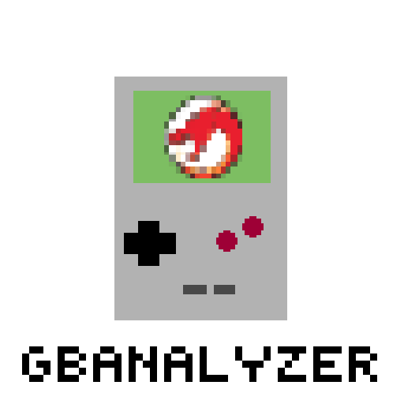

# GBAnalyzer

GBAnalyzer is a Ghidra plugin that aids in reverse-engineering Game Boy games.
- This is not a decompiler or disassembler. If you're interested in that, check out [GhidraBoy](https://github.com/Gekkio/GhidraBoy).
